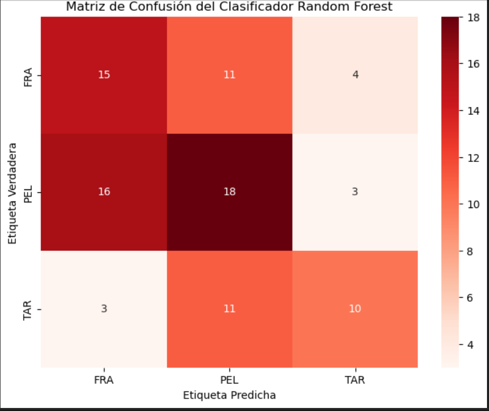
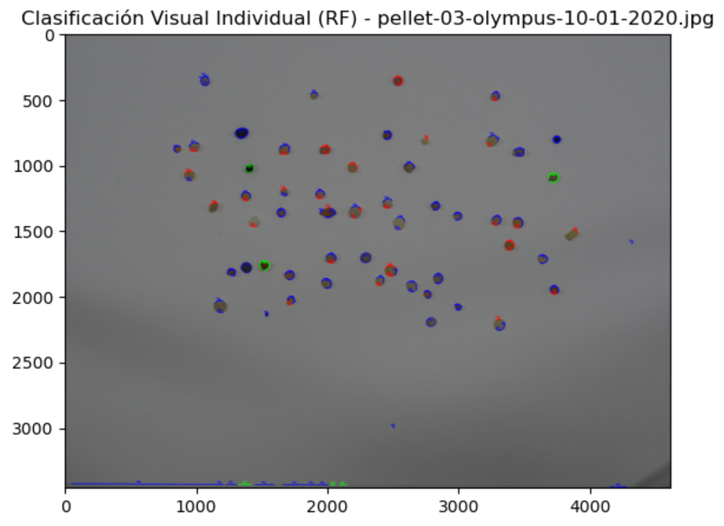
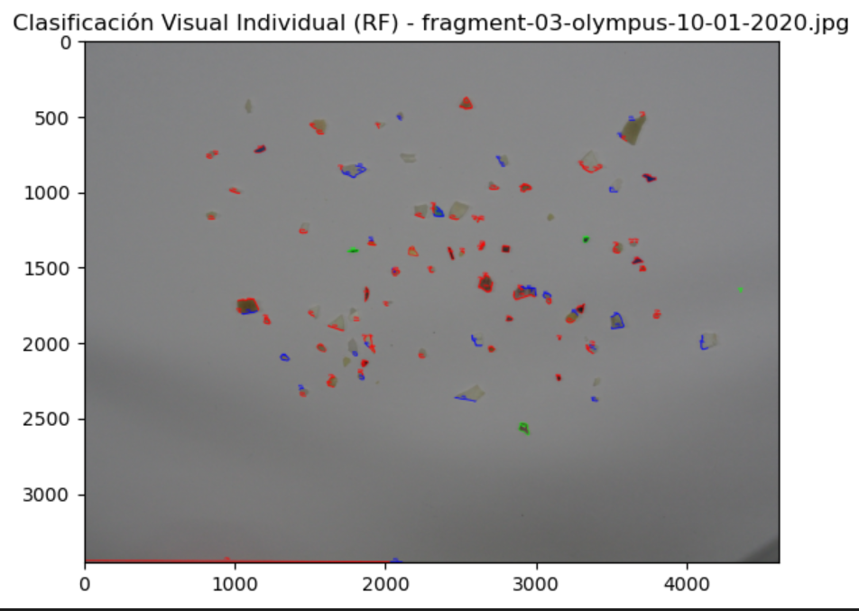
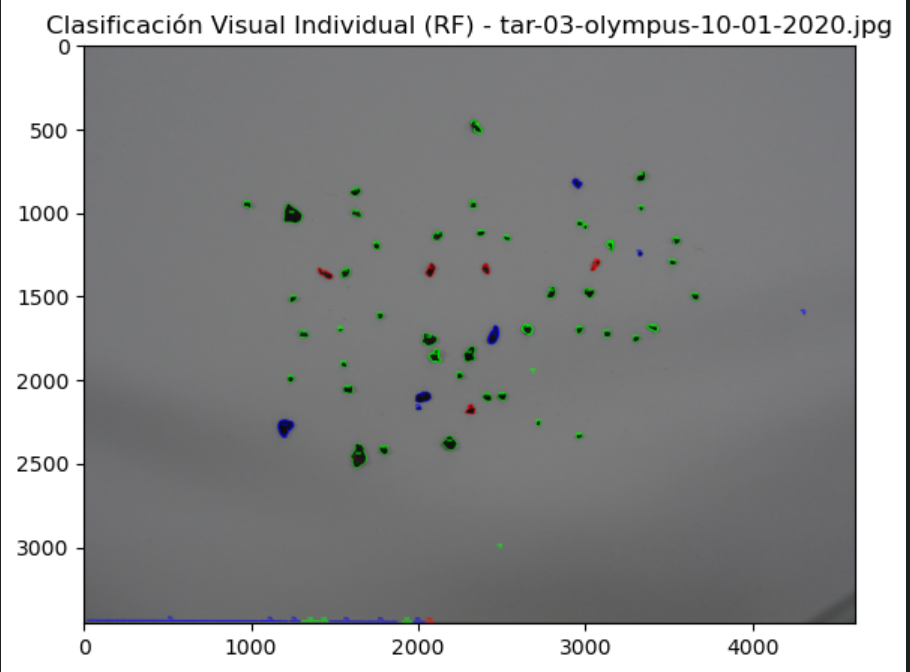

# VC - PRÁCTICA 3
## Autores del proyecto 
1. Luis Martín Pérez
2. Andrea Santana López
## Introdución
Se basa en la realización de dos actividades, donde la primera consiste en un clasificador de monedas y la otra actividad es un clasificador de microplásticos.
## Aspectos a tener en cuenta 
En las otras prácticas ya se tenían instalados Python, NumPy y Matplotlib, pero ahora hay que instalar Seaborn y Scikit-learn:
```
pip install scikit-learn seaborn
```

## Clasificador de Monedas

El script está diseñado para detectar, clasificar y sumar el valor de monedas de euro a partir de una imagen utilizando la librería OpenCV. Su precisión depende de una calibración manual que establece la relación entre píxeles y milímetros.

1. Preparación y Detección Inicial:
Se pasa la imagen por un filtro gausiano para suavizar los valores más altos, luego se detectan los circulos comprendidos entre un rango de radios razonables para unas monedas, según la escala de la imagen.
2. Calibración Interactiva:
Esta es la fase de escalado crucial. El script solicita al usuario que haga click en la moneda de 1 euro para usarla como referencia. La función del evento captura este click, identifica el círculo detectado más cercano y almacena su radio en píxeles `selected_coin_radius`. Con este dato, se calcula el valor de las demás monedas. 

3. Corrección de Sesgo y Ajuste de Rangos:
Para compensar la distorsión de la cámara (como la inclinación o la perspectiva), el script calcula la diferencia relativa (un porcentaje de error) entre el diámetro real del 1 euro y el diámetro que se acaba de detectar. A continuación, aplica esta misma corrección porcentual para ajustar dinámicamente los rangos de diámetro ideales de todas las demás monedas. Esto asegura que la clasificación se mantenga precisa aunque la imagen esté ligeramente distorsionada.

4. Clasificación Final y Resultado: El script recorre todos los círculos detectados, calcula el radio estimado de la moneda seleccionada y lo compara con los otros radios detectados para determinar su tipo (e.g., 2 euros, 50 centimos, ...). Finalmente, suma el valor de todas las monedas en `money_amount`, dibuja un círculo rojo y una etiqueta sobre cada moneda en la imagen, muestra el resultado final en la consola y el valor en cada moneda detectada.

En este fragmento de código usando el algoritmo de Hough detectamos todos los objetos circulares de la escena 
```python
circulos_detectados = cv2.HoughCircles(pimg, cv2.HOUGH_GRADIENT, 1, 100,
                                       param1=100, param2=50, minRadius=50, maxRadius=150)
```
La siguiente función es un evento para que cuando toque la moneda de 1 euro esta te devuelva los demás valores de las otras monedas.

```python
def start_count_on_mouse_click(event, x, y, flags, param):
    global circ, started_count, selected_coin_radius, calculated
    if event == cv2.EVENT_LBUTTONDOWN and not started_count:
        started_count, selected_coin_radius = select_reference_coin(circ[0], x, y, param)
    if started_count and not calculated:
        calculate_coin_amounts(circ[0], selected_coin_radius)
```
En este fragmento de código calculamos el ratio del radio entre la moneda de 1 euro y dependiendo de cómo de grande o pequeña
se respecto a esta se clasifica y se suma a la cantidad total de dinero.
```python
money_amount = 0.0
started_count = False
reference_coin_value = 1.0

def identify_coin_value_from_reference_coin(selected_coin_radius, current_coin_radius):
    global reference_coin_value
    if selected_coin_radius == 0:
        return 0.
    size_ratio = current_coin_radius * 2 / float(selected_coin_radius*2)
    scale = float(selected_coin_radius) / min(img.shape[1], img.shape[0])
    if 0.98 <= current_coin_radius / selected_coin_radius <= 1.05:
        return 1.0
    if size_ratio <= 0.66 + scale * current_coin_radius / current_coin_radius:
        return 0.01
    elif size_ratio <= 0.701 + scale * current_coin_radius / current_coin_radius:
        return 0.02
    elif size_ratio <= 0.74 + scale * current_coin_radius / current_coin_radius:
        return 0.1
    elif size_ratio <= 0.8 + scale * current_coin_radius / current_coin_radius:
        return 0.05
    elif size_ratio <= 0.8501 + scale * current_coin_radius / current_coin_radius:
        return 0.2
    elif size_ratio <= 0.95 + scale * current_coin_radius / current_coin_radius:
        return 0.5
    elif size_ratio <= 1.3 + scale * current_coin_radius / current_coin_radius:
        return 2.0
    return 0.

calculated = False
def calculate_coin_amounts(coin_circles, selected_coin_radius):
    global money_amount, calculated
    calculated = True
    for circle_x, circle_y, circle_radius in coin_circles:
        cv2.circle(img, (int(circle_x), int(circle_y)), int(circle_radius*0.3), (0, 30, 240), -1)
        cv2.circle(img, (int(circle_x), int(circle_y)), int(circle_radius*0.3 + 1), (0, 0, 0), 3)
        current_coin_value = identify_coin_value_from_reference_coin(selected_coin_radius, circle_radius)
        money_amount += current_coin_value
        cv2.putText(img, f'Coin: {current_coin_value:.2f}$', (int(circle_x - circle_radius*1.1) , int(circle_y + circle_radius*1.2)), font,
                   fontScale, (255, 0, 0), thickness, cv2.LINE_AA)
    cv2.putText(img, f"Total money amount is: {money_amount:.2f}$", (50, 50), font, fontScale, (255, 0, 0), thickness, cv2.LINE_AA)
    print(f"Total money amount is: {money_amount:.2f}$")

```

## Clasificador de Microplásticos
El segundo ejercicio se trata de crear un clasificador de microplásticos de los siguientes tipos: fragmento, pellet y alquitrán.
Por ello, tras investigar sobre posibles algoritmos de clasificación, se seleccionó Random Forest por su capacidad para clasificar los microplásticos.

Primero, se inicializaron las variables para obtener las características geométricas escogidas, que son: área y perímetro, además de las etiquetas.
```python
features_list = [] 
labels_list = []
label_map = {"FRA": 0, "PEL": 1, "TAR": 2}
reverse_label_map = {v: k for k, v in label_map.items()}
```
Segundo, declaramos las rutas de los ficheros usados para clasificar.
```python
images_data = [
    {"path": "./MicroplasticImages/pellet-03-olympus-10-01-2020.jpg", "label": "PEL"},
    {"path": "./MicroplasticImages/fragment-03-olympus-10-01-2020.jpg", "label": "FRA"},
    {"path": "./MicroplasticImages/tar-03-olympus-10-01-2020.jpg", "label": "TAR"},
]

```
Tercero, asignamos colores al tipo de microplásticos.
```python
color_map_bgr = {
    0: (0, 0, 255),    # FRA (Rojo)
    1: (255, 0, 0),    # PEL (Azul)
    2: (0, 255, 0)     # TAR (Verde)
}
```
Cuarto, creamos una función para procesar los contornos de los microplásticos de la imagen.
Primero, cargamos la imagen en formato BGR y comprobamos que exista. Luego la pasamos a escala de grises y eliminamos el ruido.
Después, umbralizamos la imagen usando un umbral adaptativo gaussiano.
Posteriormente, encontramos los contornos y vamos iterando sobre ellos con un bucle donde calculamos el área y comprobamos si es mayor de 50 píxeles.
Si lo es, hallamos el perímetro.
Si se están obteniendo las características para entrenar, se almacenan; si no, se usan para predecir con los datos que tiene, dibujando círculos de color en función del tipo de microplástico y mostrando las tres imágenes.        
```python
def process_contours(image_path,microplastic_label,is_training):
      #Comprobamos que la imagen existe
      img_bgr = cv2.imread(image_path)
      img_with_predictions = img_bgr.copy()
      if img_bgr is None:
        print(f"Error: No se pudo cargar la imagen en {image_path}")
        return
      # Preprocesamiento: Escala de grises y desenfoque
      img_gray = cv2.cvtColor(img_bgr, cv2.COLOR_BGR2GRAY)
      img_blur = cv2.GaussianBlur(img_gray, (5, 5), 0)
      # Umbral Adaptativo Gaussiano
      thresh = cv2.adaptiveThreshold(img_blur, 255, cv2.ADAPTIVE_THRESH_GAUSSIAN_C, 
                                   cv2.THRESH_BINARY_INV, 21, 5) 
      # Encontrar contornos: clave para objetos individuales
      contours, _ = cv2.findContours(thresh, cv2.RETR_EXTERNAL, cv2.CHAIN_APPROX_SIMPLE)
      for contour in contours:
        area = cv2.contourArea(contour)
        # Filtro de área mínima
        if area > 50:
            perimeter = cv2.arcLength(contour, True)
            
            if not is_training:
                predict_and_draw_contours(
                    [area, perimeter], 
                    rf_model, 
                    X.columns,
                    contour,         
                    img_with_predictions 
                )
            else:
               process_data_training([area,perimeter], microplastic_label)
      if not is_training:
           plt.figure(figsize=(10, 5))
           plt.title(f"Clasificación Visual Individual ")
           plt.imshow(cv2.cvtColor(img_with_predictions, cv2.COLOR_BGR2RGB))
           plt.show()
```
Aquí está la función que predice y dibuja los círculos.
Cargamos los datos para la predicción, predecimos la clase con el clasificador y usamos la función drawContours para dibujarla en función del tipo de microplástico.
```python
def predict_and_draw_contours(params, classifier, features_cols,contour, img_with_predictions):
      # Crear el dato para la predicción
    new_feature = pd.DataFrame([params], columns=features_cols)   
    
    # Predecir la clase
    predicted_label_code = classifier.predict(new_feature)[0] 
    predicted_class = reverse_label_map[predicted_label_code]
    color = color_map_bgr.get(predicted_label_code, (255, 255, 255))
    
    # Dibuja el contorno del objeto
    cv2.drawContours(img_with_predictions, [contour], -1, color, 3)
      
```
Aquí está la función que almacena los datos para el entrenamiento, donde se guardan los valores en features_list y labels_list.
```python
def process_data_training(params, microplastic_label):
    #Añadir los datos para el entrenamiento
    features_list.append(params)
    labels_list.append(microplastic_label) 
```
Por último, aquí está la parte donde se entrena con el algoritmo Random Forest, se genera la matriz de confusión con los datos testeados y predichos, y se muestra tanto la matriz como las tres imágenes usando los bucles que iteran sobre las imágenes para testear y predecir los tipos de microplástico.

```python
for item in images_data:
    process_contours(item["path"], label_map[item["label"]],True)

# Preparación de Datos y Entrenamiento
X = pd.DataFrame(features_list, columns=['Area', 'Perimetro'])
y = pd.Series(labels_list)
print(f"\nTotal de muestras extraídas: {len(X)}")
# División y Entrenamiento
X_train, X_test, y_train, y_test = train_test_split(X, y, test_size=0.3, random_state=42) 
rf_model = RandomForestClassifier(n_estimators=100, random_state=42)
#Entrenamiento de los datos
rf_model.fit(X_train, y_train)

# Predicción y Evaluación
y_pred = rf_model.predict(X_test)
print('\n--- Resultados de Random Forest ---')
print(f"Precisión del clasificador (Test): {accuracy_score(y_test, y_pred):.4f}")

# --- MATRIZ DE CONFUSIÓN ---
cm = confusion_matrix(y_test, y_pred)
class_names = list(label_map.keys())
plt.figure(figsize=(8, 6))
sns.heatmap(cm, annot=True, fmt='d', cmap='Reds',xticklabels=class_names, yticklabels=class_names)
plt.xlabel('Etiqueta Predicha')
plt.ylabel('Etiqueta Verdadera')
plt.title('Matriz de Confusión del Clasificador Random Forest')
plt.show()
for item in images_data:
    process_contours(item["path"],"",False)
```
<br>



<br>



<br>



<br>




## Tecnologías
1. Python
2. Matplotlib
3. Numpy
4. Searborn
5. Scikit-learn
6. Pandas

## Recursos
1. [Random Forest]( https://scikit-learn.org/stable/modules/generated/sklearn.ensemble.RandomForestClassifier.html)
2. [DataFrame](https://pandas.pydata.org/docs/reference/api/pandas.DataFrame.html)
3. [FindContours and DrawContours](https://www.youtube.com/watch?v=FczN93nT-dQ)